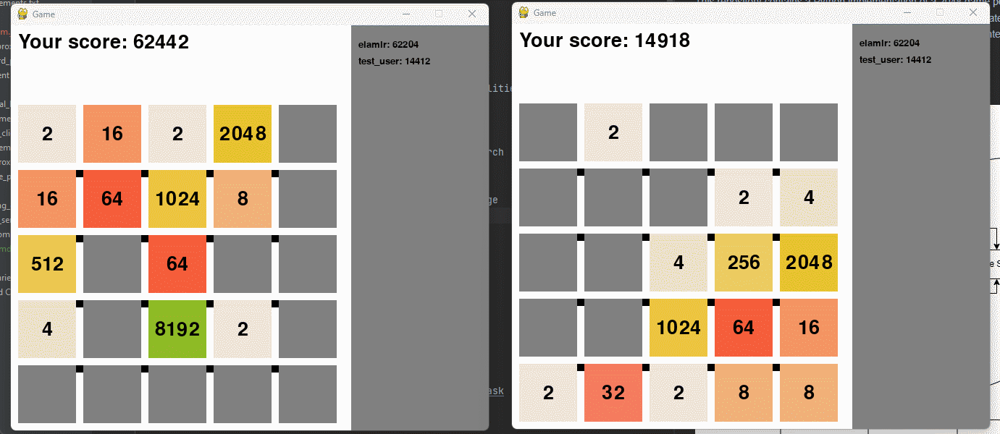
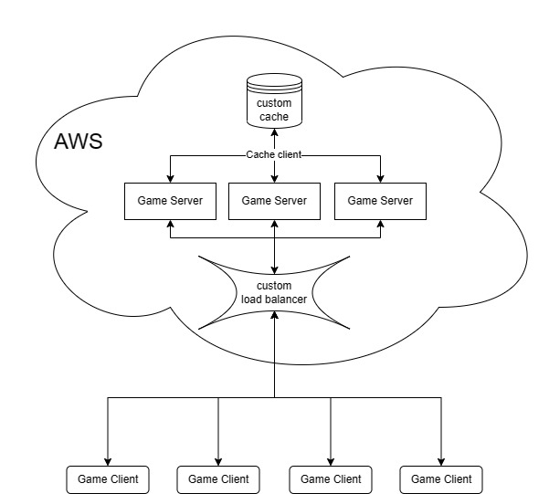

nFactorial Test Task Repository
===============================



This repository contains a Python implementation of a 2048 game powered by sockets and threading. It features a cache, cache backup, cache client, game server to store/restore game state, store score, and game client with a pygame interface. Everything is connected through sockets, and an AI bot using Monte Carlo Tree Search is included.

Description
-----------


This project demonstrates a 2048 game with various functionalities, such as:

1.  User authentication
2.  Multiple difficulty levels
3.  AI bot for automated gameplay using Monte Carlo Tree Search
4.  Game state storage and restoration
5.  Real-time score tracking
6.  Cache implementation for storing data in key-value storage
7.  Docker setup for easy deployment
8.  Deployed on the VPS to play online with other people

Installation
------------

To get started with this project, follow these steps:

1.  Clone the repository:
    
    ```bash
    git clone https://github.com/elamirKad/nfactorial_test_task
    ```
    
2.  Navigate to the project directory:
    
    ```bash
    cd nfactorial_test_task
    ```
    
3.  Install the required dependencies:
    
    `pip install -r requirements.txt`
     

Usage
-----

The command-line interface supports the following arguments:

```bash
-u, --username      The username
-p, --password      The password
-d, --difficulty    The difficulty level: 1 (easy), 2 (medium), or 3 (hard)
-b, --bot           Use bot to play the game
```

Example command:

```css
python game_client/game_client.py -u john_doe -p pass -d 1 -b
```

This will start the game with the username "john_doe", password "pass", difficulty level 1 (easy), and use the AI bot to play the game.
Use keys to play if bot is turned off.